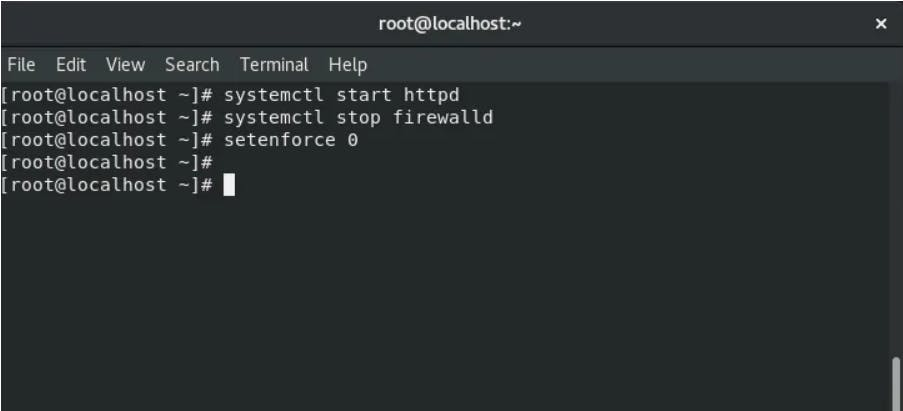
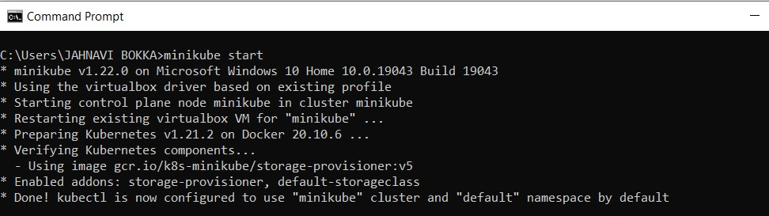
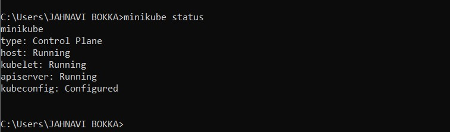
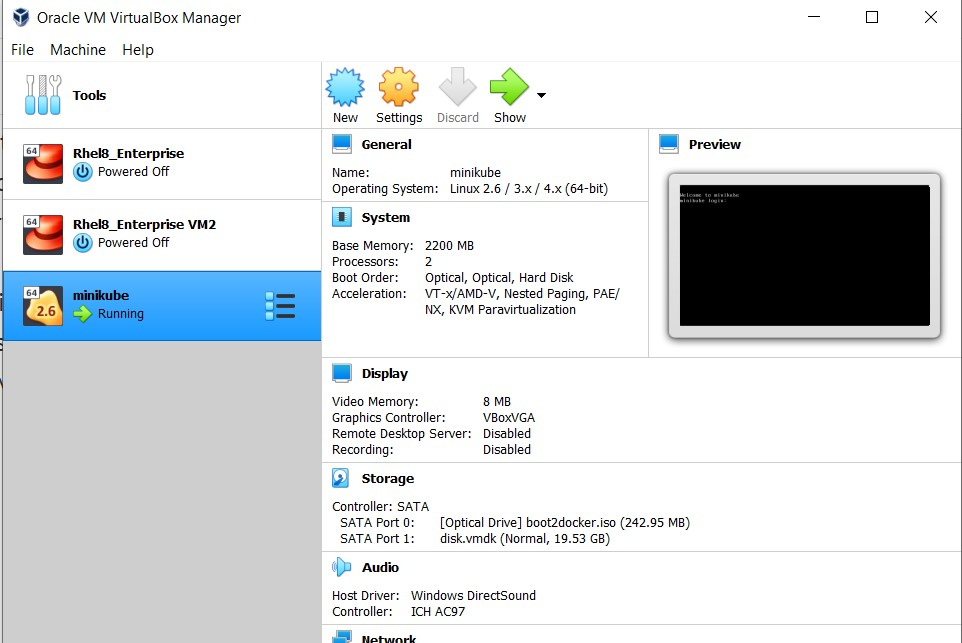
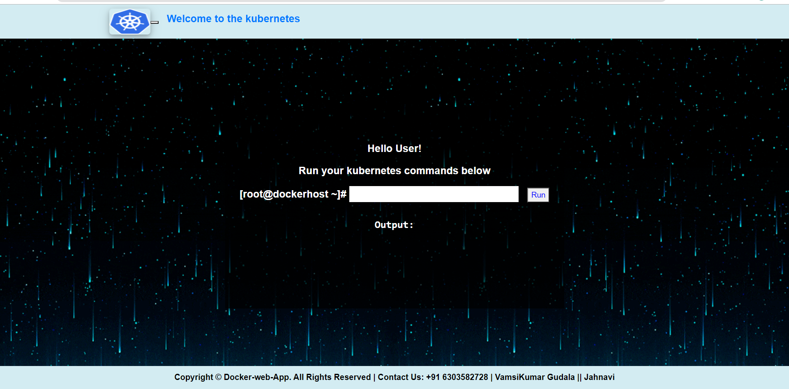
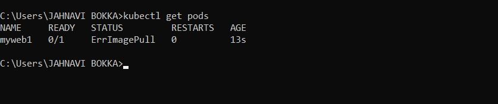

# Kubernetes(K8s) Web Application

Kubernetes (also known as k8s or “kube”) is an open source container orchestration platform that automates many of the manual processes involved in deploying, managing, and scaling containerized applications.

In other words, you can cluster together groups of hosts running Linux containers, and Kubernetes helps you easily and efficiently manage those clusters.

Simply, Kubernetes is an open source platform that offers deployment, maintenance, and scaling features. It simplifies management of containerized Python applications while providing portability, extensibility, and self-healing capabilities.

I will describe the process of deploying a simple Python application to Kubernetes, including:

1. It can launch pods with specific name given by user.
1. Run deployment using image and name given by user.
1. Expose services on given user input port number.
1. Scale the replica according to user need.
1. Delete complete environment created.
1. Delete specific resources given by user.

## Requirements:
You will need Docker, kubectl .

kubectl is a command-line interface for executing commands against a Kubernetes cluster. Run the shell script below to install kubectl:

```
curl -LO https://storage.googleapis.com/kubernetes-release/release/$(curl -s https://storage.googleapis.com/kubernetes-release/release/stable.txt)/bin/linux/amd64/kubectl
```

Deploying to Kubernetes requires a containerized application. Install kubernetes cluster on your VM and start httpd service in the VM, stop firewall as shown below.


## Start the MiniKube:

Start mini cube setup using minicube start command


Use minicube status command to check our status is ok or not, When status is ok a at the time mini cube run ine VMware



## Create a Front End WebUI for kubernates

To develop the front-end of our web page, we will be using HTML, CSS, and Javascript. HTML (the Hypertext Markup Language) and CSS (Cascading Style Sheets) are two of the core technologies for building Web pages. HTML provides the structure of the page, CSS the (visual and aural) layout, for a variety of devices. Along with graphics and scripting, HTML and CSS are the basis of building Web pages and Web Applications. The Web page is as:



### Create Executable Python File (Backend):

```
#!/usr/bin/python3
import cgi
import subprocess
import time

from datetime import datetime
print("Content-type: text/html")
print()

f = cgi. FieldStorage ( )
cmd = f.getvalue ("x")
print(cmd)
output = subprocess.getoutput("kubctl" + cmd + " -- kubeconfig admin.conf")
print("*"*100)
print()
print (output)
print()
print("*"*100)
time. sleep (0)
```
## launch a Pod using Web UI:


And similarly we can check cubectl get ports command to check port is running or not



Similarly , you can run deployment using image and name given by user, expose services on given user input port number, Scale the replica according to user need, Delete complete environment created, Delete specific resources given by user.

```
kubectl get pods

kubectl create deployment deployment _name –image Image_name

kubectl expose deployment “deployment_name” –port=80 –type=NodePort

kubectl scale deployment “deployment_name” –replicas=”number of replicas”

kubectl delete –all all

kubectl delete deployment “deployment_name”

```

This application is working properly you can execute all type cubectl command,

Thank You for reading!


